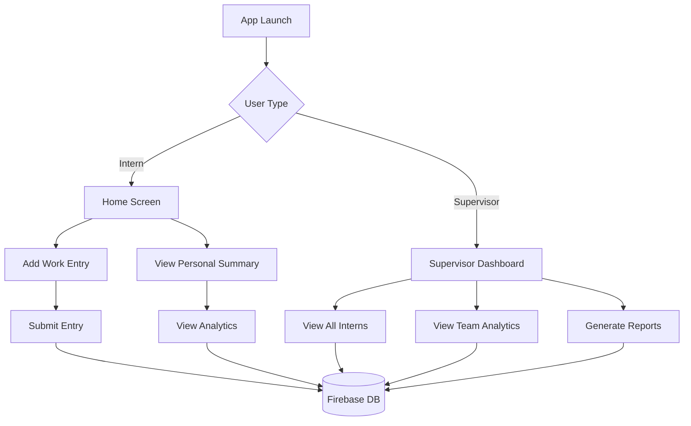

# Intern Progress Tracker - Application Flow

## 1. User Flow



## 2. Data Flow

### 2.1 Work Entry Process
1. **Intern Input**
   ```
   Start
   ├── Enter Work Details
   │   ├── Title
   │   ├── Work Type
   │   ├── Hours
   │   ├── Description
   │   └── Attachments (optional)
   ├── Validation
   ├── Submit to Firebase
   └── Update UI
   ```

### 2.2 Analytics Generation
1. **Data Processing**
   ```
   Firebase Data
   ├── Fetch Records
   ├── Process Statistics
   │   ├── Total Hours
   │   ├── Work Type Distribution
   │   └── Progress Trends
   └── Display Charts
   ```

## 3. Screen Navigation

```
Home Screen
├── Add Work Entry
│   └── Return to Home
├── Personal Summary
│   └── Return to Home
└── Supervisor Dashboard (if supervisor)
    ├── Intern Details
    ├── Team Overview
    └── Return to Dashboard
```

## 4. Data Synchronization

```
Real-time Updates
├── Firebase Listeners
│   ├── Work Entries
│   ├── User Profiles
│   └── Analytics Data
└── UI Updates
    ├── Refresh Charts
    ├── Update Lists
    └── Show Notifications
```

## 5. Component Interaction

```
UI Components ←→ State Management
     ↓               ↓
Data Models ←→ Firebase Services
     ↓               ↓
Local Storage ←→ Remote Database
```

## 6. Feature Dependencies

```
Core Features
├── Firebase Authentication
├── Cloud Firestore
├── File Storage
├── Charts Library
└── Local Storage

UI Elements
├── Material Widgets
├── Custom Animations
├── Gradient Themes
└── Responsive Layout
```

## 7. Error Handling

```
Error Flow
├── Input Validation
├── Network Errors
├── Database Errors
├── File Upload Errors
└── User Feedback
    ├── Snackbar Messages
    ├── Dialog Boxes
    └── Loading Indicators
```

## 8. Data Backup & Export

```
Export Options
├── CSV Format
│   ├── Work Entries
│   └── Analytics
├── PDF Reports
│   ├── Summary Reports
│   └── Detailed Reports
└── Data Backup
    ├── Local Cache
    └── Cloud Backup
```

## 9. Performance Considerations

- Lazy loading of data
- Efficient state management
- Optimized file handling
- Cached responses
- Batch updates
- Pagination for large datasets

## 10. Security Measures

```
Security Layer
├── User Authentication
├── Role-based Access
├── Data Encryption
├── Secure File Storage
└── Input Sanitization
```
